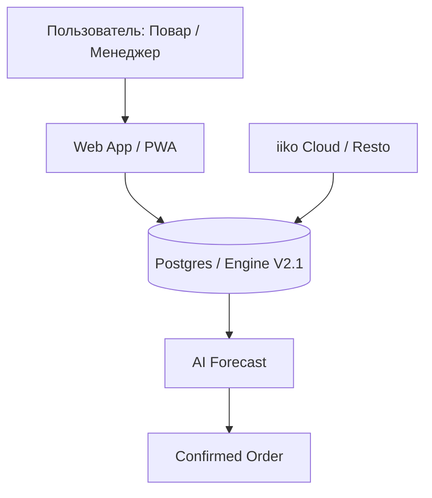

# 🧠 NeuroSupply: Единая Web-платформа (v2.4.0)

> **"От хаоса в закупках — к математической точности и единому маркетинговому преимуществу."**

Данный документ является гидом по унифицированной системе NeuroSupply v2.4.0 (Pure Web). Все управление продажами, остатками и заказами происходит в одном месте, без внешних зависимостей.

---

## 1. Концепция: Unified Platform (Pure Web)
Мы полностью отказались от Google Sheets для управления логикой. Система теперь является полностью автономным веб-приложением.

### Главные изменения v2.4.0:
- **Pure Web Settings**: Управление коэффициентами страхового запаса и "дней в пути" прямо в Dashboard.
- **Direct iiko Sync**: Мгновенная загрузка остатков и техкарт напрямую из API iiko.
- **Нейрокредиты**: Прозрачный контроль использования ИИ.
- **Excel Export**: Генерация файлов заказов за 1 клик.
- **Role-Based Access**: Интерфейс адаптирован под повара (Mini App) или менеджера (Dashboard).

---

## 2. User Flow: От Настройки до Заявки

### Этап 1: Настройка и Синхронизация (Dashboard)
1. Менеджер открывает раздел **"Настройки"** и устанавливает параметры для каждой точки (Safety Stock, Days in Transit).
2. Нажимает кнопку **"Синхронизировать данные iiko"** для актуализации остатков.

### Этап 2: Расчет и Проверка (Mini App)
1. Повар открывает Mini App и видит расчет потребности, основанный на веб-настройках.
2. Использование ИИ списывает **Нейрокредиты**.
3. Повар подтверждает количество и отправляет заказ.

### Этап 3: Утверждение и Выгрузка (Dashboard)
1. Менеджер проверяет заказ в Dashboard.
2. Выгружает Excel для поставщика или экспортирует данные.

---

## 3. Справочник ссылок

| Ресурс | Ссылка |
| :--- | :--- |
| **Dashboard (Менеджер):** | `/dashboard` |
| **Mini App (Повар):** | `/` |
| **Swagger API:** | `:8001/docs` |

---

## 4. Демонстрация (Тестовые аккаунты)
Для демонстрации и проверки потока Zero-Config используйте:

*   **Администратор**: `admin@neurosupply.ai` / `password123`
*   **Повар (DNL)**: `cook_test_1@neurosupply.ai` / `testpass123`
*   **Менеджер (DNL)**: `manager_test_1@neurosupply.ai` / `testpass123`

---

## 🌟 Статус: READY FOR DEMO v2.4.0
Система стабильна, функциональна и полностью переведена на веб-технологии.
