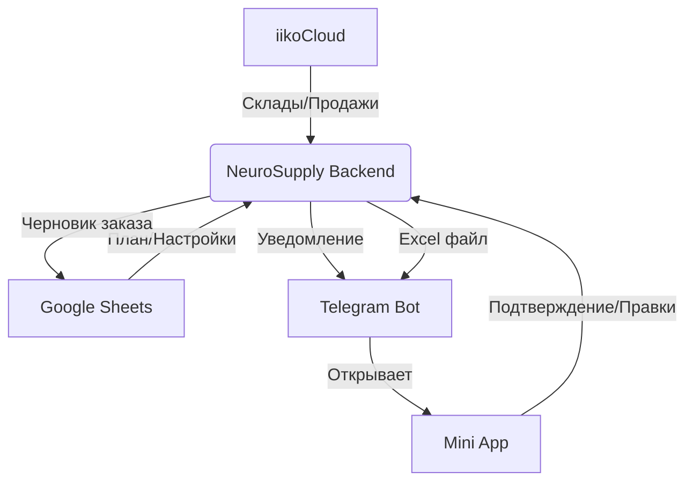

# Техническая архитектура NeuroSupply (v1.2)

Система NeuroSupply представляет собой модульный Python-сервис, объединяющий расчетную логику, интеграции с внешними SaaS (iiko, Google) и интерфейсы взаимодействия с пользователем.

---

## 🏗 Ключевые компоненты и Интеграции

### 1. Бэкенд (Core Service)
Ядро системы, написанное на **FastAPI**.
*   **Технологии**: Python 3.11, PostgreSQL (SQLAlchemy Async), APScheduler (для ночных задач).
*   **Логика взаимодействия**:
    *   **API**: Служит источником данных для Telegram Mini App.
    *   **Scheduler**: Оркестрирует запуск синхронизации (04:00) и расчета (06:00).
*   **Пути интеграции**:
    *   `src/services/calculation/engine_v2.py` — главный «процессор» потребностей.
    *   `src/services/order_service.py` — управление жизненным циклом заказов и генерация Excel.

### 2. Telegram Mini App & Bot
Фронтенд-интерфейс для линейного персонала.
*   **Роль**: Единственный инструмент повара для подтверждения заказов.
*   **Интеграция с Бэкендом**:
    *   Использует REST API бэкенда для получения списка черновиков.
    *   Отправляет `PATCH` или `POST` запросы для обновления количеств и подтверждения.
*   **Пути интеграции**:
    *   `src/bot/` — логика бота (Aiogram 3).
    *   `src/api/v1/endpoints/orders.py` — эндпоинты, обслуживающие UI приложения.

### 3. Google Sheets (Control Panel)
Инструмент для менеджмента и аналитики.
*   **Роль**: Мастер-система для настроек и ввода планов.
*   **Взаимодействие с Бэкендом**:
    *   **Pull (04:00)**: Бэкенд выкачивает настройки (Safety Stock), техкарты и планы продаж.
    *   **Push (06:00)**: Бэкенд записывает результаты расчета (Draft Order) и декомпозицию блюд (Dish Calc) обратно в таблицу.
*   **Пути интеграции**:
    *   `src/services/data_loader/sheets_client.py` — низкоуровневая работа с Google API (gspread).
    *   `src/scripts/sync_sheet_to_db.py` — скрипт массовой синхронизации данных из таблиц.

### 4. iikoCloud (Source System)
Источник фактических данных по продажам и остаткам.
*   **Роль**: Поставляет данные о фактических продажах (для обучения AI) и текущих складских остатках.
*   **Взаимодействие**:
    *   Использует API v1 (Transport/Cloud).
    *   Основной запрос: `GetSalesOlap` для получения истории выручки по категориям.
*   **Пути интеграции**:
    *   `src/services/iiko/client.py` — клиент для работы с API iiko.
    *   `src/services/data_loader/iiko_loader.py` — загрузчик данных в БД.

---

## 🔄 Схема взаимодействия (Flow)

---

## 🛠 Пути к критическим узлам для разработчика

1.  **Расчетная логика**: `src/services/calculation/engine_v2.py`
2.  **Работа с таблицами**: `src/services/data_loader/sheets_client.py`
3.  **Управление заказами**: `src/services/order_service.py`
4.  **Модели БД**: `src/db/models/`
5.  **Планировщик**: `src/scheduler.py`
