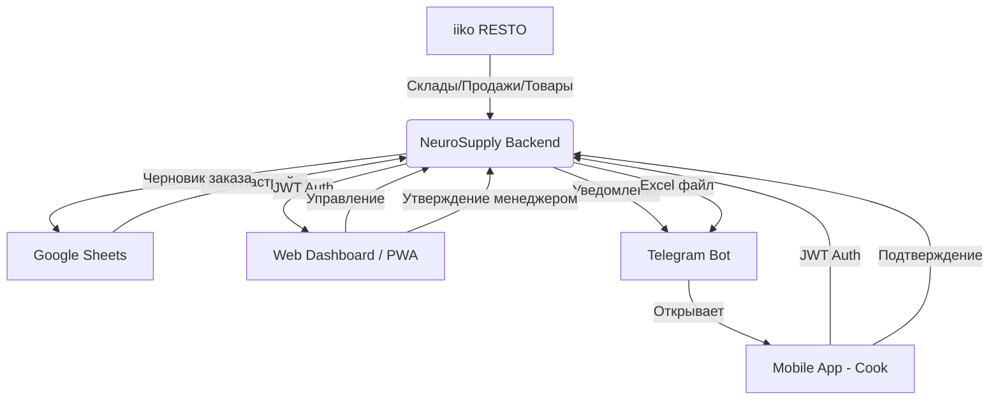

# Техническая архитектура NeuroSupply (v2.2.1 - Premium)

Система NeuroSupply представляет собой модульный Python-сервис, объединяющий расчетную логику, интеграции с внешними SaaS (iiko, Google) и современные интерфейсы взаимодействия (Web Dashboard, PWA, Telegram).

---

## 🏗 Ключевые компоненты и Интеграции

### 1. Бэкенд (Core Service)
Ядро системы на **FastAPI**.
*   **Стек**: Python 3.11, PostgreSQL 15, SQLAlchemy, APScheduler.
*   **Scheduler**: Оркестрирует ночной Pipeline (01:30 - 06:00).
*   **Расчетный движок**: `src/services/calculation/engine_v2.py` — расчет потребностей.

### 2. Веб-дашборд & PWA (Management Layer)
Основной интерфейс управления и контроля.
*   **Стек**: Next.js 15+, React, Tailwind CSS 4, shadcn/ui.
*   **PWA**: Полная поддержка установки на мобильные устройства («ярлык на экран»).
*   **Путь**: `/web/src/`

### 3. Telegram Bot & Mini App (Operational Layer)
Инструмент для линейного персонала (поваров) для инвентаризации и подачи заявок.
*   **Бот**: Aiogram 3.
*   **Mini App**: Vue 3.

### 4. iiko RESTO (Source of Truth)
Единый источник данных о номенклатуре, продажах и остатках.
*   **Тип**: iiko Chain Server (resto) API.
*   **Скрипты синхронизации**: `src/scripts/sync_*.py` (products, stock, sales).

### 5. Google Sheets (Control Panel)
Инструмент для настройки мастер-данных (Safety Stock, планы продаж).

---

## 🔄 Схема взаимодействия (Flow)

---

## 📂 Пути к критическим узлам

1.  **Расчетная логика**: `src/services/calculation/engine_v2.py`
2.  **Веб-интерфейс**: `/web/src/`
3.  **Синхронизация iiko**: `src/scripts/`
4.  **Планировщик**: `src/scheduler.py`
5.  **ИИ-локализация**: `src/scripts/translate_nomenclature.py`
