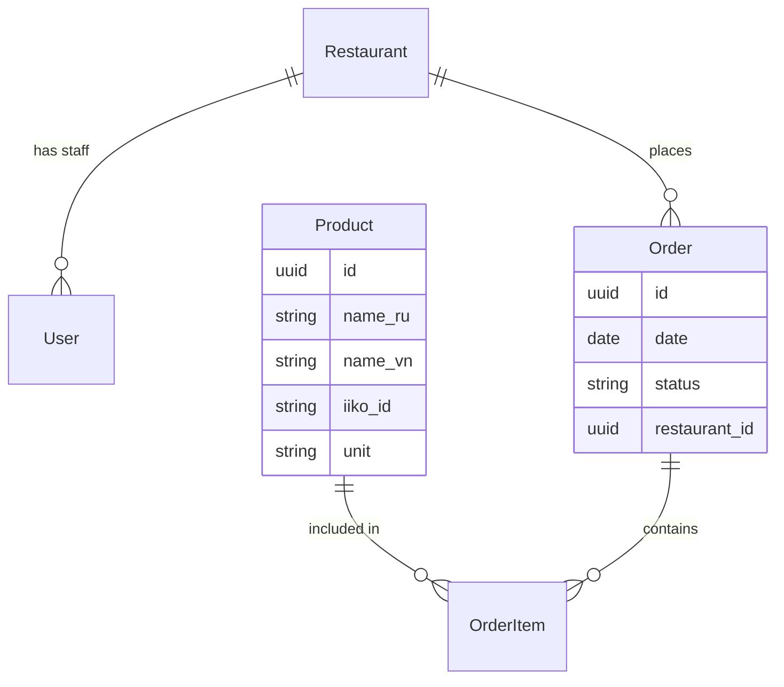

# Архитектура Системы

## Компоненты

### 1. Core API (FastAPI)
Центральный компонент, обеспечивающий взаимодействие между фронтендом (Telegram WebApp), базой данных и внешними сервисами.
*   **Endpoints**: `/api/v1/*`
*   **Documentation**: Swagger UI (`/docs`)

### 2. Database (PostgreSQL)
Хранит все данные системы. Использует асинхронный драйвер `asyncpg`.
**Основные сущности**:
*   `Users`: Пользователи системы (админы, менеджеры).
*   `Restaurants`: Рестораны, подключенные к системе.
*   `Products`: Номенклатура товаров (сырье, полуфабрикаты).
*   `Orders`: Заказы на закупку/производство.

### 3. Worker (TaskIQ)
Выполняет фоновые задачи:
*   Синхронизация с Iiko Cloud (меню, остатки, продажи).
*   Периодический пересчет прогнозов.
*   Отправка уведомлений.

### 4. Telegram Bot (Aiogram)
Интерфейс для пользователей.
*   **Команды**: `/start`, авторизация.
*   **WebApp**: Встроенное веб-приложение для формирования и проверки заказов.

### 5. Integration: Iiko Cloud
Внешняя POS-система.
*   **Service**: `src/services/iiko/client.py`
*   Используется для получения справочников товаров и данных о движениях складов.

---
## Схема Базы Данных (Упрощенно)

## Логика "Умного" Заказа
1.  **Сбор данных**: Worker регулярно забирает остатки и продажи из Iiko.
2.  **Прогноз**: На основе исторических данных рассчитывается `forecast_sales` (прогноз продаж).
3.  **Draft**: API рассчитывает `amount_needed` = `forecast_sales` - `current_stock` + `buffer`.
4.  **Верификация**: Пользователь в WebApp видит Draft, корректирует `amount_needed` и отправляет `Verify`.
5.  **Экспорт**: Подтвержденный заказ отправляется обратно в Iiko (или поставщикам).
